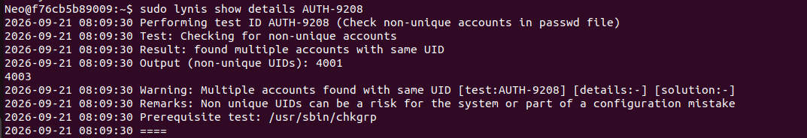
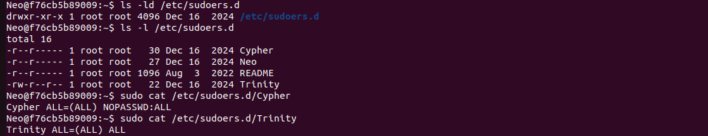
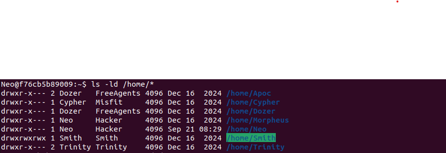
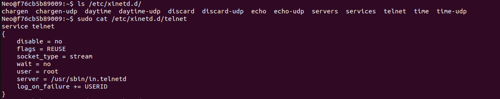
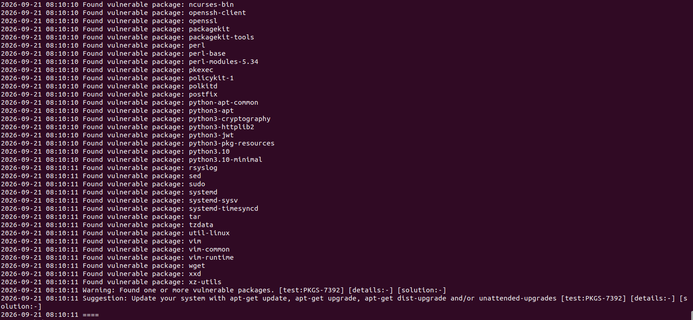

# 02 - Investigation Findings

**Date:** 2026-09-21
**Purpose:** Examine the highest-priority baseline findings in detail **before making any change**, so every fix in the remediation log is based on evidence.

Benchmark references are to the *CIS Ubuntu Linux 22.04 LTS Benchmark v1.0.0*. CIS Controls references are to v8, Implementation Group 1 unless marked otherwise.

---

## Summary

| # | Area | Lynis ID | Verdict | Severity |
|---|---|---|---|---|
| 1 | Duplicate UIDs | AUTH-9208 | Two pairs of accounts share a UID | High |
| 2 | Sudo configuration | sudoers permissions | Passwordless root for `Cypher`; world-readable `Trinity` file | High |
| 3 | Home directories | HOME-9304 / 9306 | `/home/Smith` is world-writable; ownership ambiguous for two homes | High |
| 4 | Telnet via xinetd | INSE-8100 / 8116 / 8322 | Cleartext remote login service enabled, running as root | High |
| 5 | Pending security updates | PKGS-7392 | 100+ packages including Apache, OpenSSL, sudo, polkit | High |

---

## 1. Duplicate UIDs (AUTH-9208)

### Evidence

```bash
cut -d: -f1,3 /etc/passwd | sort -t: -k2 -n
sudo lynis show details AUTH-9208
```

| UID | Accounts |
|---|---|
| **4001** | `Morpheus`, `Neo` |
| 4002 | `Cypher` |
| **4003** | `Apoc`, `Dozer` |
| 4004 | `Smith` |
| 4005 | `Trinity` |

Lynis reports `Output (non-unique UIDs): 4001, 4003`.



### Analysis

Linux identifies users by **UID**, not by name. Two accounts sharing a UID are the same user as far as file permissions, process ownership, and audit logs are concerned.

The effect is visible in the home directories (section 3): `/home/Morpheus` displays as owned by `Neo`, and `/home/Apoc` as owned by `Dozer`. Name lookup returns the first matching account in `/etc/passwd`, so the display cannot tell us who the directory really belongs to. That ambiguity is the finding.

`getent passwd` also shows each pair shares a primary GID (4001 `Hacker`, 4003 `FreeAgents`). Shared groups are legitimate, so the fix only needs to make each UID unique.

### Risk

- Each account can read, modify, and delete the other's files.
- Audit trails cannot attribute an action to a single person.
- Breaks accountability required by most compliance frameworks.

### References

- CIS Benchmark 6.2.5 Ensure no duplicate UIDs exist
- CIS Benchmark 6.2.12 Ensure local interactive users own their home directories
- CIS Controls v8 5.1 Establish and maintain an inventory of accounts

### Planned fix

Assign new unique UIDs to `Morpheus` and `Apoc`, then correct home directory ownership. `Neo` (the working account) and `Dozer` keep their UIDs. Details in the remediation log.

---

## 2. Sudo configuration

### Evidence

```bash
ls -ld /etc/sudoers.d
ls -l /etc/sudoers.d
sudo cat /etc/sudoers.d/Cypher
sudo cat /etc/sudoers.d/Trinity
```

| File | Mode | Content |
|---|---|---|
| `/etc/sudoers.d/` (directory) | `drwxr-xr-x` | flagged by Lynis |
| `Cypher` | `-r--r-----` | `Cypher ALL=(ALL) NOPASSWD:ALL` |
| `Neo` | `-r--r-----` | full passwordless sudo (confirmed earlier with `sudo -l`) |
| `README` | `-r--r-----` | default |
| `Trinity` | **`-rw-r--r--`** | `Trinity ALL=(ALL) ALL` |



### Analysis

- **`Trinity` is world-readable** (`0644`). Sudoers drop-in files should be `0440`, root-owned. Any local user can read who holds administrative rights.
- **`Cypher` has passwordless root.** A compromised or unattended session yields full root with no further authentication.
- **`Trinity`** requires a password, which is correct, but `ALL` is broad and should be reviewed for least privilege.
- **`Neo` also has `NOPASSWD: ALL`.** This is retained deliberately so the lab can proceed without password prompts, and is recorded as a **documented exception** (the layered approach: secure defaults, exceptions only when necessary, each written down).

### Risk

Weakens privilege separation and makes privilege escalation trivial after any account compromise.

### References

- CIS Benchmark 5.3.4 Ensure users must provide password for privilege escalation
- CIS Benchmark 5.3.5 Ensure re-authentication for privilege escalation is not disabled globally
- CIS Controls v8 5.4 Restrict administrator privileges to dedicated administrator accounts
- CIS Controls v8 3.3 Configure data access control lists

### Planned fix

Set `Trinity` to `0440`, require a password for `Cypher`, tighten the `/etc/sudoers.d` directory permissions, and document `Neo` as an accepted lab exception. All edits made with `visudo` to avoid syntax errors that lock out sudo.

### Cloud relevance

Equivalent to an over-permissive IAM role. In a cloud environment, prefer least-privilege roles, MFA for privileged actions, and time-limited elevation.

---

## 3. Home directories

### Evidence

```bash
ls -ld /home/*
```

| Directory | Mode | Owner : Group | Issue |
|---|---|---|---|
| `/home/Apoc` | `drwxr-x---` | Dozer : FreeAgents | Ownership ambiguous (duplicate UID 4003) |
| `/home/Cypher` | `drwxr-x---` | Cypher : Misfit | None |
| `/home/Dozer` | `drwxr-x---` | Dozer : FreeAgents | None |
| `/home/Morpheus` | `drwxr-x---` | Neo : Hacker | Ownership ambiguous (duplicate UID 4001) |
| `/home/Neo` | `drwxr-x---` | Neo : Hacker | None |
| **`/home/Smith`** | **`drwxrwxrwx`** | Smith : Smith | **World-readable, writable, and traversable** |
| `/home/Trinity` | `drwxr-x---` | Trinity : Trinity | None |



### Analysis

`/home/Smith` at mode `777` lets any user on the system read, add, replace, or delete Smith's files. This explains HOME-9304. The two ambiguous-ownership directories explain HOME-9306 and tie back to finding 1.

### References

- CIS Benchmark 6.2.13 Ensure local interactive user home directories are mode 750 or more restrictive
- CIS Benchmark 6.2.12 Ensure local interactive users own their home directories
- CIS Controls v8 3.3 Configure data access control lists

### Planned fix

`chmod 750 /home/Smith`; correct ownership of `/home/Morpheus` and `/home/Apoc` after the UID change.

---

## 4. Telnet via xinetd

### Evidence

```bash
ls /etc/xinetd.d/
sudo cat /etc/xinetd.d/telnet
```

`/etc/xinetd.d/` contains: `chargen`, `chargen-udp`, `daytime`, `daytime-udp`, `discard`, `discard-udp`, `echo`, `echo-udp`, `servers`, `services`, `telnet`, `time`, `time-udp`.

Telnet configuration:

```
service telnet
{
    disable = no
    flags = REUSE
    socket_type = stream
    wait = no
    user = root
    server = /usr/sbin/in.telnetd
    log_on_failure += USERID
}
```



### Analysis

- `disable = no` means telnet is **enabled** and started on demand by xinetd.
- It runs as `user = root`.
- Telnet sends usernames, passwords, and session data **in cleartext**.
- The directory also holds the legacy "small services" (`chargen`, `daytime`, `discard`, `echo`, `time`). `grep disable /etc/xinetd.d/*` confirmed all of these are `disable = yes`, so **telnet is the only enabled xinetd service**. `ss -tulpn` shows it listening on TCP 23 on all interfaces, alongside Apache on TCP 80. These are the only two listening ports on the system.

### Risk

Credential theft by anyone able to observe network traffic, plus a root-level network daemon with unnecessary attack surface.

### References

- CIS Benchmark section 2.2 Special Purpose Services (principle: remove services not required). This version of the benchmark has no dedicated recommendation for a telnet *server*; 2.3.4 covers the telnet *client*.
- CIS Controls v8 4.1 Establish and maintain a secure configuration process
- CIS Controls v8 4.8 Uninstall or disable unnecessary services (IG2)

### Planned fix

Stop xinetd and remove `xinetd` and `telnetd`. Replace remote access with SSH if remote administration is required.

### Cloud relevance

Cleartext protocols must never be reachable in a cloud deployment. Security groups should expose only what is required (for example 443, and 22 restricted to known addresses).

---

## 5. Pending security updates (PKGS-7392)

### Evidence

```bash
sudo lynis show details PKGS-7392
```

Lynis lists more than 100 packages with security updates waiting in the `-security` channel. `apt list --upgradable` reports 144 packages with updates available in total (145 lines including the header). Notable ones:

| Package group | Why it matters |
|---|---|
| `apache2`, `apache2-bin`, `apache2-data`, `apache2-utils` | Internet-facing web server |
| `openssl`, `libssl3`, `libgnutls30`, `ca-certificates` | TLS and certificate handling |
| `libc6`, `libc-bin`, `systemd`, `util-linux`, `mount` | Core system libraries and tools |
| `sudo`, `policykit-1`, `pkexec`, `polkitd`, `libpam-*` | Privilege management and authentication |
| `openssh-client`, `postfix`, `rsyslog`, `git`, `vim`, `wget`, `perl`, `python3.10` | Network-facing and commonly targeted tools |



### Analysis

The system is materially behind on patches. Unpatched Apache, OpenSSL, and privilege-related packages carry the highest risk because they are either exposed to the network or used for privilege escalation.

### References

- CIS Benchmark 1.9 Ensure updates, patches, and additional security software are installed
- CIS Controls v8 7.3 Perform automated operating system patch management
- CIS Controls v8 7.4 Perform automated application patch management

### Planned fix

`apt-get update` and `apt-get upgrade`, then restart Apache and re-check. Confirm `unattended-upgrades` is configured for ongoing patching.

### Cloud relevance

Patching responsibility is the clearest example of the shared responsibility model. In IaaS the customer patches the guest OS. In PaaS the provider patches the platform. This feeds directly into the service-model recommendation.

---

## Additional observations (to confirm)

| Observation | Source | Follow-up |
|---|---|---|
| `postfix` is installed | Package list, MAIL-8820 | Not listening on port 25 (confirmed with `ss`). Decide if a mail service is needed; if not, remove (Benchmark 2.2.15) |
| `rsyslog` installed but no log daemon running | LOGG-2130 | Enable and verify (Benchmark 4.2.2.x) |
| `telnetd` system account exists (UID 107) | `/etc/passwd` | Package removal usually leaves system accounts behind; check and remove with `userdel` if it remains |

## Evidence

| File | Description |
|---|---|
| [`evidence/2-investigation_output.txt`](../evidence/2-investigation_output.txt) | Full terminal output for this investigation |
| `evidence/screenshots/2-duplicate-uids.png` | Duplicate UID output |
| `evidence/screenshots/3-sudoers-review.png` | Sudoers permissions and contents |
| `evidence/screenshots/4-home-directories.png` | Home directory listing |
| `evidence/screenshots/5-xinetd-telnet.png` | xinetd directory and telnet config |
| `evidence/screenshots/6-vulnerable-packages.png` | Vulnerable package output |

## Next

[03 - Remediation Log](./03-remediation-log.md)