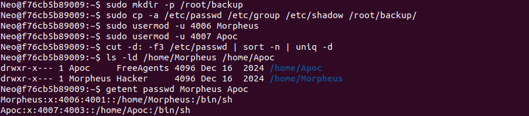
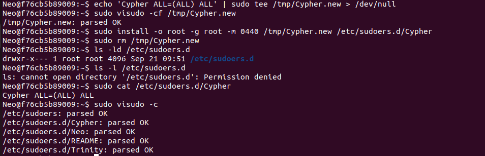
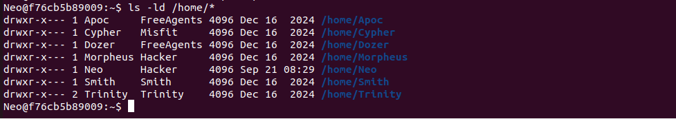
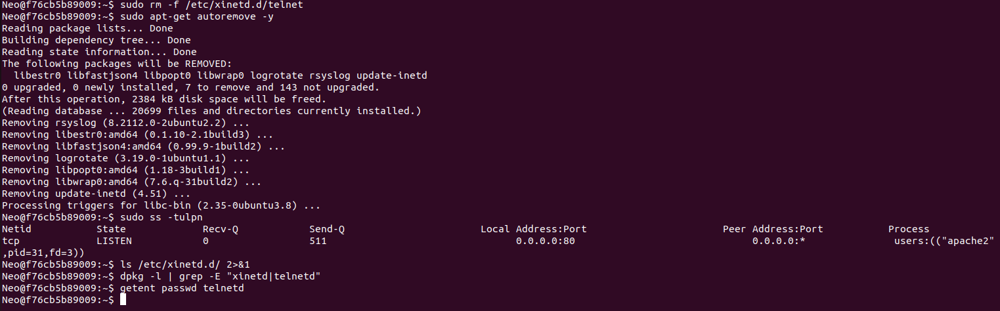
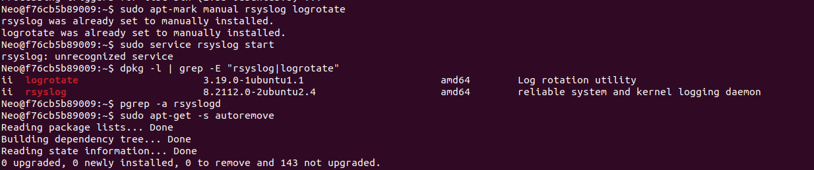

# 03 - Remediation Log

**Date:** 2026-09-21
**Baseline hardening index:** 56 / 100
**Method:** each change follows the same cycle: investigate, back up, fix, verify, record. Account and sudoers files were backed up to `/root/backup/` before editing.

Full terminal output: [`evidence/3-remediation_output.txt`](../evidence/3-remediation_output.txt)

## Status overview

| # | Fix | Lynis ID | Status |
|---|---|---|---|
| 1 | Duplicate UIDs | AUTH-9208 | Done |
| 2 | Sudo configuration | sudoers permissions | Done (one documented exception) |
| 3 | World-writable home directory | HOME-9304 / 9306 | Done |
| 4 | Telnet and xinetd removed | INSE-8100 / 8116 / 8322 | Done |
| 5 | Pending security updates | PKGS-7392 | Done |
| 6 | Incident: logging packages removed by `autoremove` | LOGG-2130 | Packages restored; service start pending |
| 7 | Audit log ownership and permissions | (found during investigation) | Pending |

---

## Fix 1: Duplicate UIDs (AUTH-9208)

| Field | Detail |
|---|---|
| **Finding** | `Morpheus` and `Neo` shared UID 4001. `Apoc` and `Dozer` shared UID 4003. |
| **Risk** | Accounts with the same UID are the same user to the OS: shared file access, ambiguous ownership, and audit logs that cannot attribute actions. |
| **Fix** | Gave `Morpheus` UID 4006 and `Apoc` UID 4007. `usermod -u` also re-owns files inside each home directory. |
| **Reference** | CIS Benchmark 6.2.5, 6.2.12. CIS Controls v8 5.1. |

```bash
sudo mkdir -p /root/backup
sudo cp -a /etc/passwd /etc/group /etc/shadow /root/backup/
sudo usermod -u 4006 Morpheus
sudo usermod -u 4007 Apoc
```

**Verification**

```bash
cut -d: -f3 /etc/passwd | sort -n | uniq -d      # no output: no duplicates
ls -ld /home/Morpheus /home/Apoc
getent passwd Morpheus Apoc
```

Result: no duplicate UIDs. `/home/Morpheus` is now owned by `Morpheus:Hacker` and `/home/Apoc` by `Apoc:FreeAgents`. `getent` shows `Morpheus` as 4006 and `Apoc` as 4007. Shared primary groups were left unchanged because sharing a group is legitimate.



**Cloud relevance:** every identity needs to be unique and attributable. This is the same principle behind unique IAM users and roles, and it is what makes cloud audit trails (for example CloudTrail-style logs) trustworthy.

---

## Fix 2: Sudo configuration

| Field | Detail |
|---|---|
| **Finding** | `/etc/sudoers.d/Trinity` was world-readable (`0644`). `Cypher` had `NOPASSWD:ALL`. |
| **Risk** | Any local user could see who holds admin rights, and a compromised `Cypher` session gave root with no further authentication. |
| **Fix** | Set `Trinity` to `0440`, tightened the directory to `750`, and required a password for `Cypher`. The new `Cypher` file was validated with `visudo` before installation so a typo could not break sudo. |
| **Reference** | CIS Benchmark 5.3.4, 5.3.5. CIS Controls v8 5.4, 3.3. |

```bash
sudo cp -a /etc/sudoers.d /root/backup/sudoers.d
sudo chmod 0440 /etc/sudoers.d/Trinity
sudo chmod 750 /etc/sudoers.d

echo 'Cypher ALL=(ALL) ALL' | sudo tee /tmp/Cypher.new > /dev/null
sudo visudo -cf /tmp/Cypher.new
sudo install -o root -g root -m 0440 /tmp/Cypher.new /etc/sudoers.d/Cypher
sudo rm /tmp/Cypher.new
```

**Verification**

```bash
ls -ld /etc/sudoers.d          # drwxr-x--- root root
sudo cat /etc/sudoers.d/Cypher # Cypher ALL=(ALL) ALL
sudo visudo -c                 # all files parsed OK
```

Result: all sudoers files parse correctly. Listing the directory as a normal user now returns `Permission denied`, which confirms it is no longer world-readable.



**Documented exception:** `Neo` keeps `NOPASSWD:ALL`. It is the lab working account and removing it would block the exercise. On a production system this would be replaced with a password requirement or time-limited elevation. The `/etc/sudoers.d` mode of 750 is stricter than the Ubuntu default (755) and is not required by the CIS benchmark. It was applied on Lynis's guidance and will be confirmed by the re-scan.

**Cloud relevance:** equivalent to over-permissive IAM roles. Use least privilege, MFA for privileged actions, and time-limited elevation.

---

## Fix 3: World-writable home directory

| Field | Detail |
|---|---|
| **Finding** | `/home/Smith` was mode `777`. |
| **Risk** | Any user could read, add, replace, or delete Smith's files. |
| **Fix** | `sudo chmod 750 /home/Smith` |
| **Reference** | CIS Benchmark 6.2.13. CIS Controls v8 3.3. |

**Verification**

```bash
ls -ld /home/*
```

Result: all seven home directories are `drwxr-x---`, and every directory is owned by the account it is named after.



---

## Fix 4: Remove telnet and xinetd

| Field | Detail |
|---|---|
| **Finding** | Telnet was enabled through xinetd, running as root and listening on TCP 23. |
| **Risk** | Telnet sends credentials and session data in cleartext, and it added a root-level network service for no business need. |
| **Fix** | Stopped xinetd, purged `xinetd` and `telnetd`, and removed the leftover custom `/etc/xinetd.d/telnet` file (the purge left it behind because it was not part of the package). |
| **Reference** | CIS Benchmark section 2.2 (special purpose services). CIS Controls v8 4.1, 4.8 (IG2). |

```bash
dpkg -S /usr/sbin/in.telnetd        # telnetd
sudo service xinetd stop
sudo apt-get purge -y xinetd telnetd
sudo rm -f /etc/xinetd.d/telnet
```

**Verification**

```bash
sudo ss -tulpn                       # only port 80 (Apache)
ls /etc/xinetd.d/                    # empty
dpkg -l | grep -E "xinetd|telnetd"   # no results
getent passwd telnetd                # no results
```

Result: port 23 is closed and the `telnetd` account was removed with the package. The only listening service is Apache on TCP 80.



**Cloud relevance:** cleartext administration protocols must never be reachable. Security groups should expose only required ports, and remote administration should use SSH with restricted source addresses.

---

## Incident and lesson: `autoremove` removed logging packages

After removing telnet, `sudo apt-get autoremove -y` also removed **rsyslog** and **logrotate**. Both had been flagged as automatically installed, so apt treated them as no longer needed once xinetd and telnetd were gone. The `-y` flag confirmed the removal without the list being reviewed.

**Impact:** rsyslog is the system logging service and logrotate manages log growth. Removing them would have worked against CIS Benchmark 4.2.2.1 and CIS Controls v8 8.2 (collect audit logs).

**Recovery**

```bash
sudo apt-get install -y rsyslog logrotate
sudo apt-mark manual rsyslog logrotate
sudo apt-get -s autoremove        # dry run
```

Result: both packages reinstalled (`rsyslog 8.2112.0-2ubuntu2.4`, which is also the current patched version) and the dry run reports nothing to remove.



**Lessons**

1. Preview cleanup with `apt-get -s autoremove` before running it, and never combine it with `-y` on a system you are hardening.
2. Mark packages you depend on with `apt-mark manual`.
3. Every hardening change needs a verification step. Here the review of the package list caught a side effect that a simple "telnet is gone" check would have missed.

**Cloud relevance:** the same discipline applies to infrastructure-as-code. Preview changes (a plan or dry run) before applying them, because removing a "dependency" can silently remove something the system relies on.

**Follow-up:** the `rsyslog` package is installed, but the service is not yet running. The container has no init script for it, so it is started directly. This will be recorded with the logging work.

---

## Fix 5: Pending security updates (PKGS-7392)

| Field | Detail |
|---|---|
| **Finding** | 144 packages had updates available, including Apache, OpenSSL, sudo, polkit, systemd, libc, and OpenSSH client. |
| **Risk** | Known, publicly documented vulnerabilities left unpatched on an internet-facing server. |
| **Fix** | Refreshed package lists, applied all updates, and restarted Apache. |
| **Reference** | CIS Benchmark 1.9. CIS Controls v8 7.3, 7.4. |

```bash
apt list --upgradable 2>/dev/null > ~/evidence/pre-patch-upgradable.txt
sudo apt-get update
sudo apt-get upgrade -o Dpkg::Options::="--force-confold"
sudo service apache2 restart
```

`--force-confold` keeps locally modified configuration files during upgrades so hardened settings are not overwritten.

**Verification**

```bash
apache2 -v                               # Server built: 2026-07-06
apt list --upgradable 2>/dev/null | wc -l   # 1 (header line only)
sudo ss -tulpn                           # Apache on port 80, new process ID
```

Result: 143 packages upgraded by `apt-get upgrade` and `rsyslog` brought current during the reinstall, so all 144 are patched. No updates remain pending. Apache restarted cleanly.

**Notes**

- `apache2 -v` still reports `2.4.52`. Ubuntu backports security fixes into the same upstream version, so the patch level is shown by the package revision (`2.4.52-1ubuntu4.12` to `2.4.52-1ubuntu4.23`) and the build date (`2024-07-17` to `2026-07-06`), not the version number.
- The `postfix` upgrade opened a configuration prompt. **Local only** was selected, which sets `inet_interfaces: loopback-only`. This is the safe choice for a server that does not relay mail, and it aligns with CIS Benchmark 2.2.15 (mail transfer agent in local-only mode).
- Apache printed a warning that it could not determine the server's fully qualified domain name. This is not an error, and setting a global `ServerName` is on the Apache hardening list.
- The apt sources include a third-party repository (`deadsnakes` PPA for Python). Third-party repositories widen the software supply chain and should be justified or removed.


**Cloud relevance:** patching is the clearest example of the shared responsibility model. In IaaS the customer patches the guest OS and applications. In PaaS the provider patches the platform. This directly shapes the service-model recommendation.

---

## Pending: audit log ownership and permissions

Found during the UID investigation:

```
drwxr-x--- 1 root adm   /var/log/audit
-rw-rw-rw- 1 Neo Hacker /var/log/audit/audit.log      (0 bytes)
```

The audit log is owned by a regular user and is **world-writable** (`0666`). Audit logs must not be modifiable by ordinary users, otherwise an attacker can tamper with the evidence. The `auditd` package is installed but the service is not running.

Relevant controls: CIS Benchmark 4.1.4.1 (mode 0640 or less permissive), 4.1.4.2 (owned by an authorized user), 4.1.4.3 (authorized group), and CIS Controls v8 8.2, 8.3.


Planned fix: `chown root:adm` and `chmod 0640`, then review audit configuration file permissions (4.1.4.5 to 4.1.4.10).

---

## Still to do

| Item | Lynis ID | CIS reference |
|---|---|---|
| Start rsyslog and confirm log writing | LOGG-2130 / 2138 | 4.2.2.x, v8 8.2 |
| Audit log permissions and auditd configuration | ACCT-9628 | 4.1.4.x, v8 8.2 |
| Stricter umask | AUTH-9328 | 5.5.4, v8 3.3 |
| Password aging and hashing rounds | AUTH-9230 / 9286 | 5.5.x, v8 5.2 |
| Login banners | BANN-7126 / 7130 | 1.7.x, v8 4.1 |
| ModSecurity and Apache benchmark review | HTTP-6643 | Apache benchmark, v8 4.1 |
| Apache `ServerName` warning | (Apache) | Apache benchmark |
| Malware scanner | HRDN-7230 | v8 10.1 |
| Unused network protocols | NETW-3200 | 3.4.x, v8 4.1 |
| Re-run Lynis and compare to baseline (56) | n/a | n/a |